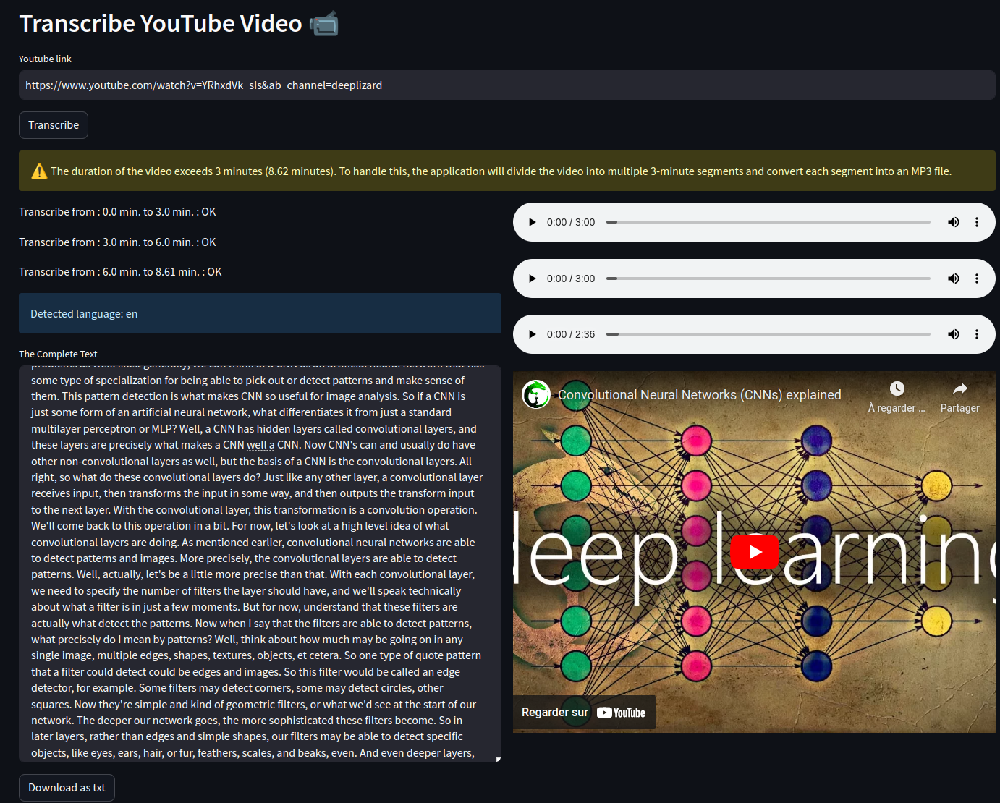
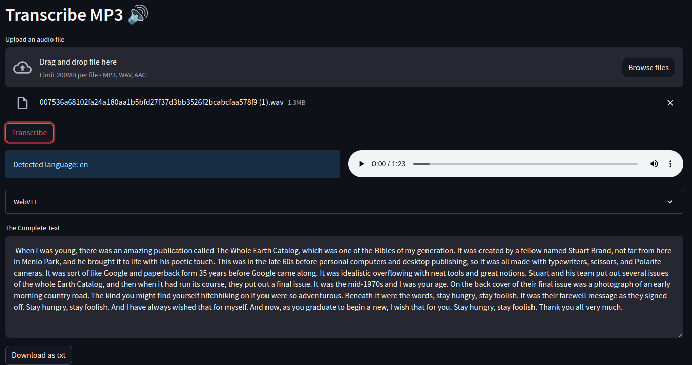
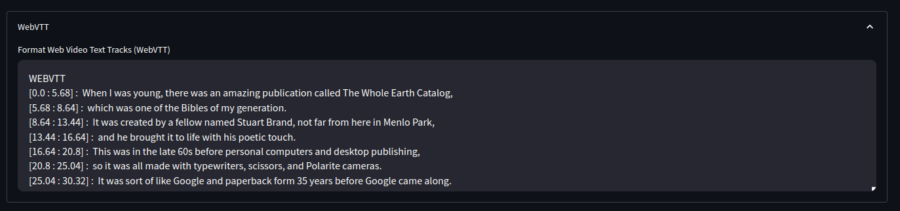
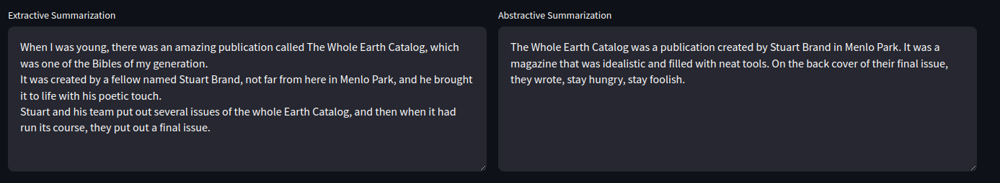

# Transcribe YouTube Video

This streamlit application allows you to transcribe any YouTube video by providing the YouTube link. It utilizes the Whisper speech recognition model developed by OpenAI to automatically detect the language and transcribe the video's audio.

---

## Demo

You can try out the application by accessing the online demo [here](https://emaddar-whisper-streamlit-app-hjg7jx.streamlit.app/).

---

## Installation

To run the application locally, follow these steps:

1. Clone the repository:

```bash
git clone https://github.com/emaddar/whisper_streamlit
```
2. Install the required dependencies:

```bash
pip install -r requirements.txt
```
3. Run the application:
```bash
streamlit run app.py
```
---

## Usage
1. Enter the YouTube link of the video you want to transcribe in the provided text input field.

2. Click the "Transcribe" button to initiate the transcription process.

3. The application will download the YouTube video, convert it to MP3 format, transcribe the audio using the Whisper model, and display the transcribed text.

4. The detected language, transcription segments with their corresponding timestamps, and a download button for the transcribed text as a CSV file will be shown.

5. You can listen to the audio and watch the video alongside the transcribed text.





---

## New Features
- `28/06/2023` **Transcribe Audio Files**: You can now select your audio file (.mp3, .wav, .aac) and the application will transcribe it for you.

- `04/07/2023` **WebVTT Transcription**: The application now includes an expander feature where you can find the transcription in Web Video Text Tracks (WebVTT) format. This format allows you to easily integrate the transcribed text into web-based video players or platforms that support WebVTT subtitles.


- `05/07/2023`: **Extractive & Abstractive Summarization**: Whenever you request a transcription of an audio or video, the application will also provide two types of text summaries - extractive and abstractive summarization.


---

## Contributing
Contributions to this project are welcome. Feel free to open issues or submit pull requests for any improvements or fixes you would like to contribute.
